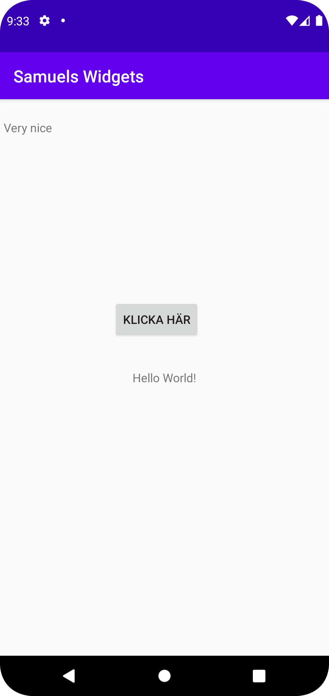

# Rapport

**Först forkade jag projektet från github, jag gjorde sedan en constraint layout. Sedan gjorde jag en
textView och constrainade den till övre vänstra hörnet. Efter detta lade jag in en imageView, som jag 
constrainade till mitten av skärmen. Sist lade jag även in en knapp som jag ändrade namn på samt constrainade
under bilden ** 

